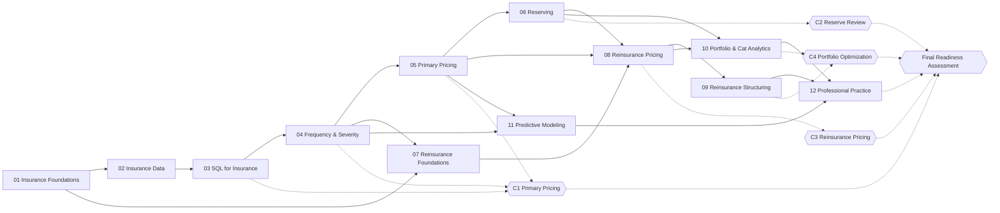

# Curriculum Dependency Map

What must be in place before each module and capstone, where each core concept is first taught and where it returns, and how MAS-I topics show up in the work.

## Module and capstone prerequisites

Solid arrows are module prerequisites; dotted arrows are capstone prerequisites. Module 12 depends on every earlier module; only its direct predecessors are drawn.

### Prerequisite table

| Module | Requires | Why |
|---|---|---|
| 01 Insurance Foundations | — | Entry point |
| 02 Insurance Data | 01 | Needs written/earned premium, claim lifecycle, year conventions |
| 03 SQL for Insurance | 02 | Needs table grain, keys and transaction logic before querying them |
| 04 Frequency & Severity | 03 | Pulls exposure, counts and losses from the database |
| 05 Primary Pricing | 04 | Builds on frequency, severity, trend and large-loss treatment |
| 06 Reserving | 05 | Development was previewed in pricing; reserving completes it |
| 07 Reinsurance Foundations | 01, 04 | Needs gross/net and severity intuition (limits, LEV) |
| 08 Reinsurance Pricing | 05, 06, 07 | Experience rating reuses trend, on-leveling and development; needs treaty mechanics |
| 09 Reinsurance Structuring | 08 | Compares structures priced and simulated in 08 |
| 10 Portfolio & Cat Analytics | 06, 08 | Uses simulation from 08 and development/uncertainty ideas from 06 |
| 11 Predictive Modeling | 04, 05 | GLMs refine the frequency/severity and indication work |
| 12 Professional Practice | All | Integrated work and final assessment |

| Capstone | Requires |
|---|---|
| C1 Primary Pricing Study | 03, 04, 05 |
| C2 Reserve Review | 06 |
| C3 Reinsurance Pricing | 08 |
| C4 Reinsurance Portfolio Optimization | 09, 10 |
| Final Readiness Assessment | 12 and C1–C4 passed |

## Concept reuse

| Concept | First taught in | Used again in |
|---|---|---|
| Written, earned, unearned premium; exposure | 01 | 02, 03, 04, 05, 08 |
| Loss, LAE, expense and combined ratios | 01 | 05, 09, 12 |
| Accident, policy, calendar and development years | 01 | 03, 06, 08 |
| Gross, ceded, net; direct vs assumed | 01 | 07, 08, 09 |
| Data separated from interpretation from recommendation | 01 | Every module |
| Table grain, keys, transactions to snapshots | 02 | 03, 06, C1, C2 |
| Data validation and reconciliation | 02 | 03 and every capstone |
| Claim status, reopened claims, report and settlement lags | 02 | 06, C2 |
| Joins, CTEs, window functions | 03 | 04, 06, C1 |
| Frequency, severity, pure premium | 04 | 05, 08, 11 |
| Severity distributions and limited expected value | 04 | 07, 08, 09 |
| Large-loss capping and excess loading | 04 | 05, 08 |
| Trend (frequency and severity separately) | 04 | 05, 08, 09 |
| Compound Poisson aggregate loss | 04 | 08, 09, 10 |
| On-level premium | 05 | 08 |
| Credibility | 05 | 08 |
| Actual vs expected | 05 | 06, 12 |
| Loss development and triangles | 05 (preview), 06 | 08, C2 |
| Expected loss ratio and Bornhuetter-Ferguson | 06 | 08, C2 |
| Layer losses, attachment, exhaustion | 07 | 08, 09, 10 |
| Reinstatements and reinstatement premium | 07 | 08, 09, 10 |
| Ceding, sliding-scale and profit commissions | 07 | 08, 09 |
| Monte Carlo simulation | 08 | 09, 10, C4 |
| ILFs and exposure curves | 08 | 09 |
| Technical vs market price | 08 | 09, C3, C4 |
| Volatility, tail risk, capital, earnings stability | 09 | 10, C4 |
| Return periods, OEP/AEP, PML, TVaR | 10 | C4, 12 |
| GLMs and model validation | 11 | 12 |

## MAS-I topic map

Spec §35 asks that exam material be tied to the work wherever it fits. The table below lists where each topic is used; [reference/mas1_crosswalk.md](../reference/mas1_crosswalk.md) holds the concrete Kettlerock applications and grows as sessions add them.

| Topic | Insurance application | Module(s) |
|---|---|---|
| Poisson process; thinning | Claim counts; splitting claims into those that reach a layer and those that do not | 04, 08 |
| Compound Poisson | Aggregate claims; annual layer loss | 04, 08, 10 |
| Non-homogeneous Poisson process | Seasonal catastrophe frequency; reporting rates | 10 |
| Mixture distributions; negative binomial | Heterogeneous risk across classes and insureds | 04, 11 |
| Coverage modifications: deductibles, limits, limited expected value | Policy limits, deductibles, reinsurance layers, ILFs | 01 (intuition), 04, 07, 08 |
| Conditional expectation and variance | Severity analysis; mean excess loss above an attachment | 04, 08 |
| Survival models, hazard rates, Kaplan-Meier | Time to report, time to settle, time to reopen | 02, 06 |
| Markov chains | Claim status transitions (open, closed, reopened) | 06 |
| Maximum likelihood, method of moments, estimator properties | Fitting severity distributions | 04 |
| Confidence intervals and hypothesis tests | Trend significance; actual-vs-expected tests | 04, 05, 11 |
| Order statistics and extremes | Largest loss in a year; PML | 08, 10 |
| Linear regression | Log-linear trend fitting | 04, 05 |
| Generalized linear models | Pricing segmentation; frequency and severity models | 11 |
| Model selection (AIC, BIC, cross-validation) | GLM variable selection | 11 |
| Time series | Inflation and calendar-year trend series | 05, 09 |
| Monte Carlo simulation | Treaty pricing; portfolio risk; capital | 08, 09, 10 |
| Credibility † | Ratemaking; experience rating | 05, 08 |

† Credibility sits mainly on later CAS exams (MAS-II and Exam 5) rather than MAS-I; it is included because spec §35 names it. Syllabus placement of other topics also shifts between sittings, so treat the topic column as a guide, not an exam outline.
