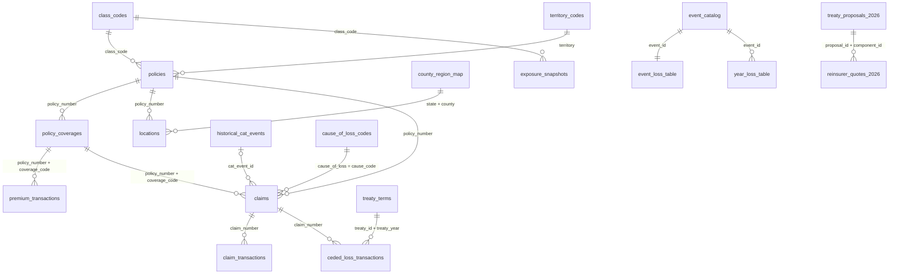

# Data dictionary: Kettlerock Mutual

> **This data is synthetic and contains realistic data-quality problems. Validate before use.**

Kettlerock Mutual Insurance Company is a fictional regional commercial-lines mutual (CA, GL, CP, WC in TX, LA, OK, AR, NM, CO). Every file is evaluated at **2025-12-31**. Amounts are US dollars. Dates are ISO `YYYY-MM-DD`. Keys are text.

The pages linked below document each table's intended structure: grain, key, column meanings and conventions. Whether the data actually conforms is for you to check.

## Entity-relationship diagram

## Tables: grain and key

| Table | Folder | Grain (one row per...) | Key |
|---|---|---|---|
| [policies](policies.md) | raw/policies | policy term | `policy_number` |
| [policy_coverages](policy_coverages.md) | raw/policies | policy term x coverage | `policy_number` + `coverage_code` |
| [locations](locations.md) | raw/policies | CP policy term x location | `policy_number` + `location_id` |
| [premium_transactions](premium_transactions.md) | raw/premiums | premium movement | `transaction_id` |
| [claims](claims.md) | raw/claims | claim (claimant x coverage) | `claim_number` |
| [claim_transactions](claim_transactions.md) | raw/claims | financial or status movement on a claim | `transaction_id` |
| [exposure_snapshots](exposure_snapshots.md) | raw/exposures | month-end x coverage x state x class | `month_end` + `coverage_code` + `state` + `class_code` |
| [treaty_terms](treaty_terms.md) | raw/reinsurance | treaty x treaty year | `treaty_id` + `treaty_year` |
| [ceded_loss_transactions](ceded_loss_transactions.md) | raw/reinsurance | claim x treaty x year-end evaluation with a change | `cession_id` |
| [treaty_proposals_2026](treaty_proposals_2026.md) | raw/reinsurance | proposal x component | `proposal_id` + `component_id` |
| [reinsurer_quotes_2026](reinsurer_quotes_2026.md) | raw/reinsurance | proposal x component x reinsurer | `quote_id` |
| [casualty_ilf_table](casualty_ilf_table.md) | raw/reinsurance | line x limit | `line` + `limit` |
| [property_exposure_curves](property_exposure_curves.md) | raw/reinsurance | occupancy x value band x damage ratio | `occupancy` + `tiv_band_low` + `damage_ratio` |
| [historical_cat_events](historical_cat_events.md) | raw/catastrophe | catastrophe event | `cat_event_id` |
| [event_catalog](event_catalog.md) | raw/catastrophe | stochastic event | `event_id` |
| [event_loss_table](event_loss_table.md) | raw/catastrophe | stochastic event | `event_id` |
| [year_loss_table](year_loss_table.md) | raw/catastrophe | simulated event occurrence | `sim_year` + `event_id` + `day_of_year` |
| [rate_change_history](rate_change_history.md) | reference | line x rate change | `line` + `effective_date` |
| [expense_assumptions](expense_assumptions.md) | reference | line x year | `line` + `year` |
| [class_codes](class_codes.md) | reference | rating class | `class_code` |
| [territory_codes](territory_codes.md) | reference | rating territory | `territory` |
| [cause_of_loss_codes](cause_of_loss_codes.md) | reference | cause of loss code | `cause_code` |
| [county_region_map](county_region_map.md) | reference | state x county | `state` + `county` |

Keys describe the intended design. The database does not enforce them.

## Join paths

| Question | Path |
|---|---|
| Claim to the policy, line, class and territory | `claims.policy_number` = `policies.policy_number`; then `policies.class_code` = `class_codes.class_code`, `policies.territory` = `territory_codes.territory` |
| Claim to its coverage terms (limit, deductible) | `claims.policy_number` + `claims.coverage_code` = `policy_coverages.policy_number` + `coverage_code` |
| Claim financials at any date | `claim_transactions.claim_number` = `claims.claim_number`, filtered on `transaction_date` <= the evaluation date |
| Claims from one occurrence or catastrophe event | group `claims` on `occurrence_id`; `claims.cat_event_id` = `historical_cat_events.cat_event_id` |
| Premium detail for a coverage | `premium_transactions.policy_number` + `coverage_code` = `policy_coverages.policy_number` + `coverage_code` |
| Policy renewal chain | `policies.renewal_of` = prior term's `policies.policy_number`; `insured_id` is stable across terms |
| Property locations and catastrophe regions | `locations.policy_number` = `policies.policy_number`; `locations.state` + `county` = `county_region_map.state` + `county` gives `cat_region` |
| Ceded, gross and net by claim | `ceded_loss_transactions.claim_number` = `claims.claim_number`; latest row per claim x treaty on or before the evaluation; `treaty_id` + `treaty_year` = `treaty_terms` |
| Stochastic catastrophe losses | `year_loss_table.event_id` = `event_catalog.event_id` = `event_loss_table.event_id` |
| 2026 structures and prices | `reinsurer_quotes_2026.proposal_id` + `component_id` = `treaty_proposals_2026.proposal_id` + `component_id` |

Property claims are recorded against the policy, not a specific location.

## Time conventions

| Basis | Derived from |
|---|---|
| Accident year | year of `claims.accident_date` |
| Report year | year of `claims.report_date` |
| Policy year | year of `policies.effective_date` |
| Calendar year (transactions) | year of `claim_transactions.transaction_date` or `premium_transactions.transaction_date` |
| Treaty year (losses occurring) | accident year |
| Development age | months from the start of the accident year to the evaluation date (12 at the end of the accident year) |

## Building the database

See [`../processed/README.md`](../processed/README.md). Each CSV loads into a SQLite table of the same name.
